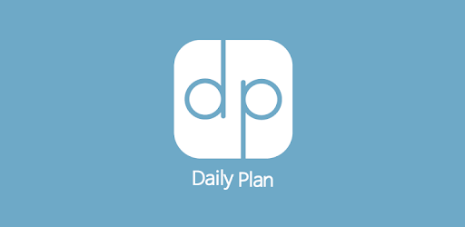
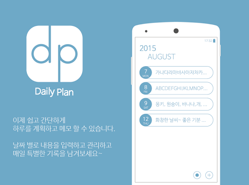
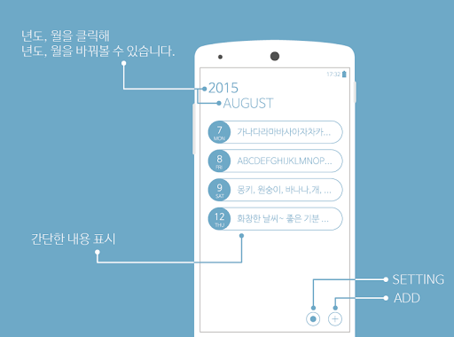
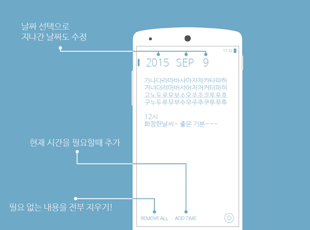
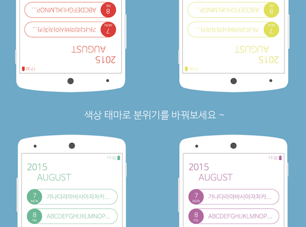
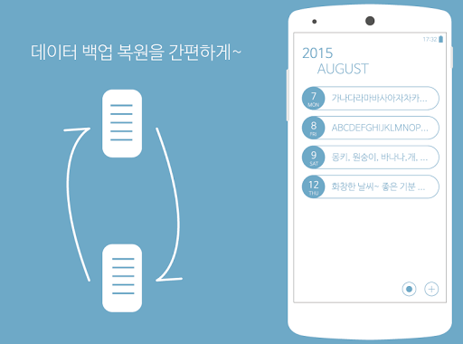

# daily-plan-lite

`updated` : 2016년 6월 10일   
`status` : [product](https://play.google.com/store/apps/details?id=com.kiristudio.lee.jong.hyuck)

simple daily diary  

~~~
Easily record your day and let management !
Font size , PW setup , data backup and restore
Cange the colors according to the daily routine -

1. This app uses nanum font of 'NAVER'

2. In MainPage or InsertPage, you can select year, month, date

3.Error occured when creating password or when unlock, password be reset to ''0000'
  
4. Data backuped in 'Storage/Daily plan/database' existing backups are deleted. All current data is restored when you switch to restore the data .

5. If you set the font size on your system, the font size can not be changed .

6. When error occured, I would appreciate sent to the following e-mail.

ver.1.1509071020
lite can not use the color, password.
~~~   

   
   
   
   
   
